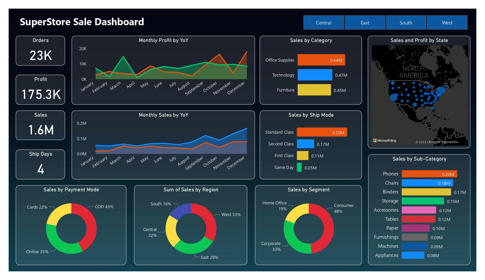
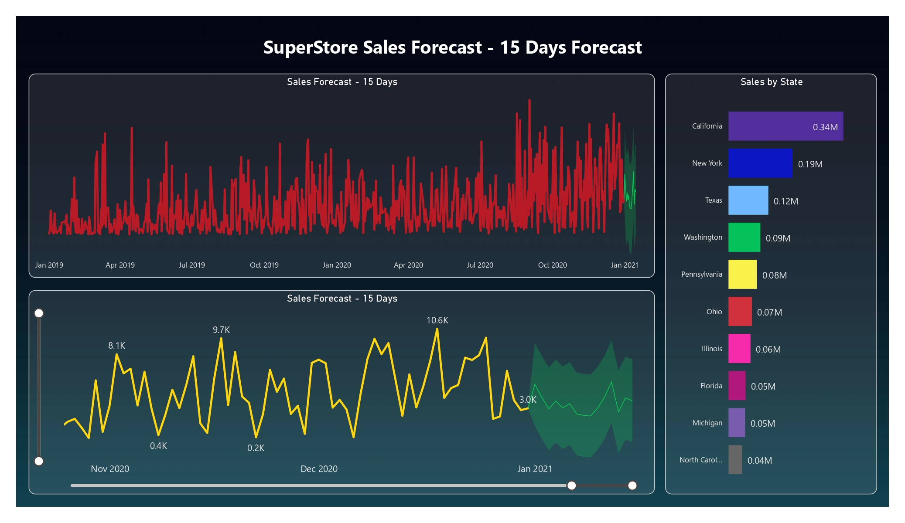

 # StoreVision: Data-Driven Sales & Forecasting

 Welcome to **StoreVision**, a Power BI dashboard designed to analyze and forecast sales performance. This project delivers a clear and structured view of sales trends, category performance, and forecasting, highlighting insights that support evidence-based business decisions.

## 📈 Project Overview

Sales performance plays a vital role in business strategy and growth. This dashboard was developed to translate complex sales data into actionable insights. By visualizing patterns across product categories, customer segments, shipping modes, and regions, it provides a comprehensive view of sales drivers and future trends. The focus is on making data-driven insights accessible and meaningful to both technical and business audiences.

## 📚 Data Structure & Cleaning Overview

The dataset includes records for thousands of transactions, with the following attributes:

| Column Name              | Data Type | Description |
|---------------------------|-----------|-------------|
| Row ID                    | int64     | Unique identifier for each row |
| Order ID                  | object    | Unique order identifier |
| Order Date                | object    | Date when the order was placed |
| Ship Date                 | object    | Date when the order was shipped |
| Ship Mode                 | object    | Mode of shipment (e.g., Standard, Second Class) |
| Customer ID               | object    | Unique customer identifier |
| Customer Name             | object    | Customer's name |
| Segment                   | object    | Market segment (e.g., Consumer, Corporate) |
| Country                   | object    | Country of the customer |
| City                      | object    | City of the customer |
| State                     | object    | State of the customer |
| Postal Code               | int64     | Postal code |
| Region                    | object    | Region of the store |
| Product ID                | object    | Unique product identifier |
| Category                  | object    | Product category |
| Sub-Category              | object    | Product sub-category |
| Product Name              | object    | Product name |
| Sales                     | float64   | Sales amount |
| Quantity                  | int64     | Quantity of products ordered |
| Discount                  | float64   | Discount applied |
| Profit                    | float64   | Profit amount |
| AvgDelivery               | float64   | Average delivery time |
| Payment Mode              | object    | Payment mode used |

### 📊 SalesForecast Table
Additionally, a **SalesForecast** table was created to provide forward-looking insights:
- **Order Date**: Date for which sales are forecasted.
- **Total Sales**: Predicted total sales for the corresponding date.

### 🧹 Data Cleaning & Transformation Steps:
- Removed duplicate records and handled missing or inconsistent values.
- Standardized categorical fields and ensured correct date formats.
- Created relationships between **SalesForecast** and **SuperStore_Sales_Dataset** for combined analysis.
- Applied advanced DAX queries for dynamic measures and KPIs.
- Used AI-assisted data cleaning and forecasting models to enhance data quality and accuracy.

These steps ensured the data was clean, reliable, and ready for meaningful visualization.

## 📸 Dashboard Preview

  
   <em>Figure 1: SuperStore Sales Dashboard - An interactive dashboard showcasing sales performance across categories, regions, shipping modes, and customer segments.</em>
    
  
   <em>Figure 2: Predictive Analysis - AI-enhanced sales forecasting and time series analysis for proactive business planning.</em>

## 📅 Executive Summary

This dashboard uncovers important patterns in sales performance:

🔹 **Category & Segment Analysis**  
Reveals high-performing categories like Technology and Furniture, and identifies key customer segments driving revenue.

🔹 **Shipping & Regional Trends**  
Analyzes sales performance by shipping modes and regions, highlighting logistical insights.

🔹 **Time Series Insights**  
Tracks monthly sales trends year-over-year to reveal growth patterns and seasonal shifts.

🔹 **AI-Powered Forecasting**  
Integrates AI-enhanced sales forecasts for proactive planning and decision-making.

🔹 **Optimized Performance**  
Applies advanced DAX queries for dynamic reporting and improved dashboard responsiveness.

By presenting these insights through intuitive visuals, the dashboard enables business leaders and analysts to understand and act on key sales drivers.

## 🔍 Insights Deep Dive

### 🎯 Category and Segment Performance
- Highlights top-performing product categories and customer segments.
- Identifies opportunities for targeted marketing and sales strategies.

### 🚚 Logistics and Region Analysis
- Compares sales by shipping mode and regional contributions for logistical optimization.
- Uncovers shipping delays and cost factors.

### 📈 Sales Forecasting
- Forecasts future sales using AI-enhanced models.
- Supports proactive decision-making with accurate short-term predictions.

## 💡 Recommendations & Future Enhancements

This project offers valuable sales insights and lays the foundation for future growth:

- Expand forecasting models to include longer-term predictions.
- Integrate customer behavior and satisfaction metrics.
- Enhance dashboard interactivity with real-time data feeds.
- Develop predictive models for churn and customer segmentation.

## 🚀 How to Use
1. **Clone this repository**.
2. Open `SuperSale_Dashboard.pbix` in **Power BI Desktop**.
3. Load the base dataset if necessary.
4. Perform data cleaning and transformation steps as needed.
5. Explore the dashboard using filters and slicers for detailed analysis.
